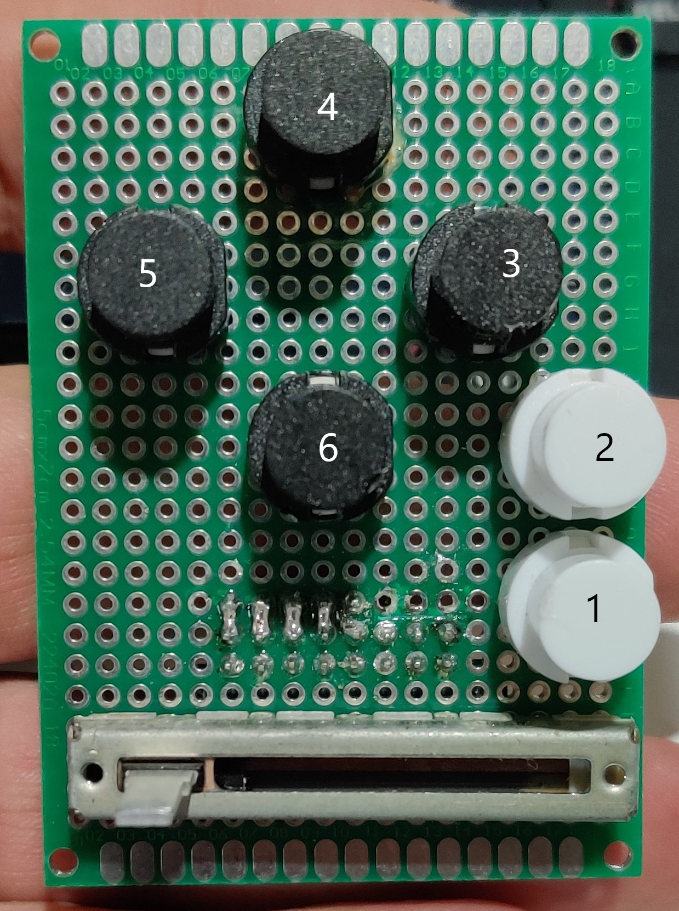
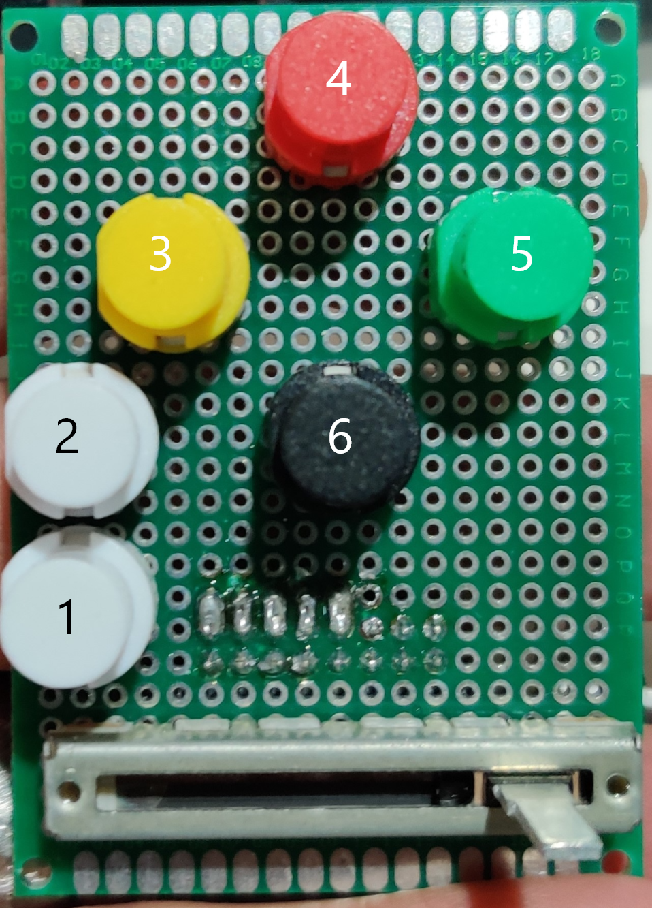
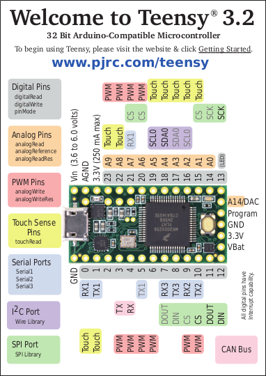

# Wiring 

## Button pad wiring

## Button pads

| underside Pin Layout |  left layout | right layout |
| - | - | - |
|  |  |  |

| Pin | purpose     | Teensy Pin L  | Teensy Pin R | Todo L | Todo R |
|-|-|-|-|-|-|
| 0 | negative      | A GND         | A GND     | none | Do all |
| 1 | positive      | 3.3           | 3.3       | none | Do all |
| 2 | stick button  | 20            | (16) A14  | 10k ohm to gnd | Do all |
| 3 | stick 0       | (17) A3       | A10       | done | Do all |
| 4 | stick 1       | (18) A4       | A11       | done | Do all |
| 5 | slide         | (19) A5       | A14       | done | Do all |
| 6 | trigger 0     | 21            | 2         | 10k ohm to gnd | Do all |
| 7 | trigger 1     | 22            | 3         | 10k ohm to gnd | Do all |
| 8 | nc | | |
| 9 | nc | | |
| 10 | button 6     | 10            | 4         | 10k ohm to gnd | Do all |
| 11 | button 5     | 11            | 5         | 10k ohm to gnd | Do all |
| 12 | button 4     | 12            | 6         | 10k ohm to gnd | Do all |
| 13 | button 3     | 23            | 7         | 10k ohm to gnd | Do all |
| 14 | button 2     | 16            | 8         | 10k ohm to gnd | Do all |
| 15 | button 1     | 15            | 9         | 10k ohm to gnd | Do all |

## Teensy pinouts

|Teensy front|teensy back|
|-|-|
| |  |
## Todos

